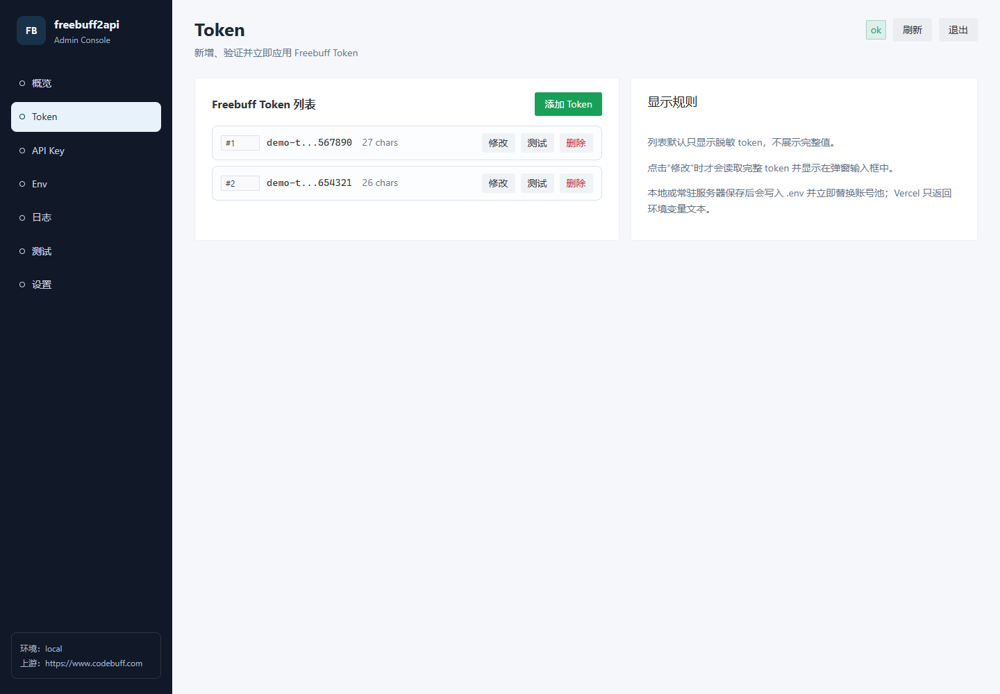
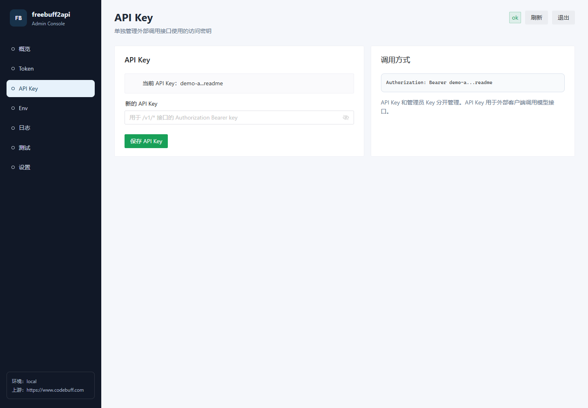
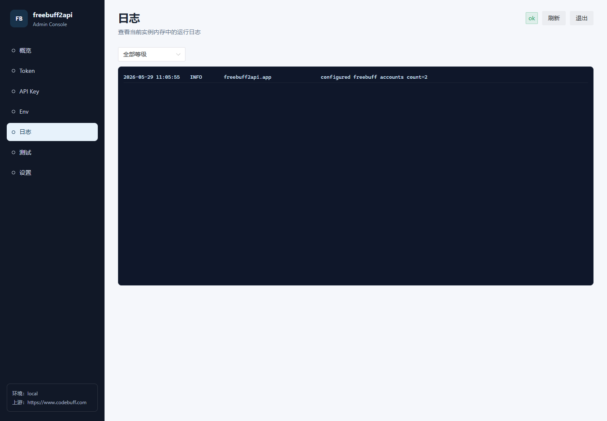

# freebuff2api

Codebuff Freebuff 的 OpenAI-compatible API 适配服务。部署后可以像调用 OpenAI Chat Completions 一样调用 Freebuff 模型。

[](https://vercel.com/new/clone?repository-url=https://github.com/t479842598/freebuff2api-vercel&env=FREEBUFF_TOKEN,FREEBUFF_API_KEY,FREEBUFF_ADMIN_KEY&envDescription=FREEBUFF_TOKEN%20%E5%A1%AB%E5%86%99%20Freebuff%20token%EF%BC%8CFREEBUFF_API_KEY%20%E5%A1%AB%E5%86%99%20API%20%E8%AE%BF%E9%97%AE%E5%AF%86%E9%92%A5%EF%BC%8CFREEBUFF_ADMIN_KEY%20%E5%A1%AB%E5%86%99%E7%AE%A1%E7%90%86%E9%9D%A2%E6%9D%BF%E7%99%BB%E5%BD%95%E5%AF%86%E9%92%A5&envLink=https://github.com/t479842598/freebuff2api-vercel#%E7%8E%AF%E5%A2%83%E5%8F%98%E9%87%8F&project-name=freebuff2api-vercel&repository-name=freebuff2api-vercel)

## 更新日志

### 2026-06-10

- 同步原始项目 `freebuff2api-main-oran` 的 Freebuff 上游兼容逻辑：HAR 风格请求头、固定上游 User-Agent、`Accept-Encoding` / `Connection` / `Host` 指纹、waiting-room 广告链路后的 `/api/v1/freebuff/streak` 调用。
- 同步 OpenAI 消息标准化逻辑：`developer` 转 `system`，system message 添加 `cache_control: ephemeral`，缺少 system message 时自动注入 `You are Buffy...` 上游提示。
- 新增 Freebuff 模型映射：`minimax/minimax-m3`、`mimo/mimo-v2.5`、`mimo/mimo-v2.5-pro`。
- 移除 `FREEBUFF_BROWSER_UA` 示例配置，使用固定 HAR 浏览器 UA，避免部署环境意外改变上游请求指纹。
- 保留当前管理版能力：`/admin` 管理面板、Vercel 入口、API Key 初始化保护、日志缓冲、本地 `.env` 写回和部署文档。
- 限定 pytest 只收集当前项目 `tests/`，避免原始项目快照目录里的同名测试干扰。

## 功能

- OpenAI-compatible Chat Completions API，可直接接入支持 OpenAI 格式的客户端。
- 支持流式和非流式对话，接口路径兼容 `/v1/chat/completions`。
- 内置 Freebuff / Gemini free agent 模型映射，通过 `/v1/models` 获取模型列表。
- 支持多个 `FREEBUFF_TOKEN` 账号池，并发请求会优先分配空闲账号。
- 支持本地 API Key 鉴权，公开部署时可保护 `/v1/*` 接口。
- 内置 Vue 3 + Naive UI 管理面板，可管理 Token、API Key、Env、日志和模型调用。
- 支持 Vercel 部署；管理面板会明确提示 Vercel 环境变量需要在后台修改并重新部署。

## 接口

- `GET /healthz`
- `GET /v1/models`
- `POST /v1/chat/completions`
- `GET /admin` 管理面板

## 快速开始

### 1. 获取 Freebuff Token

无需安装 Freebuff / Codebuff CLI，可以直接打开公开页面自动获取 token：

```text
https://freebuff.071129.xyz/
```

操作流程：

1. 打开上面的地址。
2. 选择 `Freebuff`。
3. 点击“开始认证”，在跳转页面完成授权。
4. 回到页面复制展示的 token。
5. 本地运行时写入 `.env`；部署 Vercel 时写入 Vercel 的 Environment Variables。

示例：

```dotenv
FREEBUFF_TOKEN=你的 Freebuff Bearer token
```

多账号可用英文逗号分隔。并发请求会优先分配到空闲账号，避免单个 Freebuff 账号的全局 active free session 被并发切模型请求互相覆盖：

```dotenv
FREEBUFF_TOKEN=token-a,token-b,token-c
```

### 2. 本地配置

新建 `.env` 文件并填写：

```dotenv
FREEBUFF_TOKEN=你的 Freebuff Bearer token
FREEBUFF_API_KEY=
FREEBUFF_ADMIN_KEY=sk-admin
FREEBUFF_API_BASE_URL=https://www.codebuff.com
FREEBUFF_AD_PROVIDERS=gravity,zeroclick
FREEBUFF_TIMEOUT=60
FREEBUFF_PROXY_ENABLED=false
FREEBUFF_PROXY_URL=
FREEBUFF_DEBUG=false
FREEBUFF_LOG_LEVEL=INFO
FREEBUFF_LOG_BODY_CHARS=2000
FREEBUFF_LOG_COLOR=true
FREEBUFF_ADMIN_LOG_LINES=1000
FREEBUFF_HOST=0.0.0.0
FREEBUFF_PORT=8000
FREEBUFF_TIMEZONE=Asia/Shanghai
FREEBUFF_LOCALE=zh-CN
FREEBUFF_OS=windows
```

`FREEBUFF_ADMIN_KEY` 默认是 `sk-admin`。启动后可以先用这个默认 key 进入管理面板，再在设置页修改成自己的管理员密钥。公开部署时请务必修改默认值。

`FREEBUFF_TOKEN` 和 `FREEBUFF_API_KEY` 可以先留空，进入管理面板后按页面提示填写。保存后本地或常驻服务器会写回 `.env`，并在当前进程中热更新生效；Vercel 环境会返回应粘贴到 Environment Variables 的文本。

`FREEBUFF_API_KEY` 是你自己给这个 API 服务设置的访问密钥。设置后，请求时需要带上：

```http
Authorization: Bearer 你的本地 API key
```

如果 `FREEBUFF_API_KEY` 留空，`/v1/*` API 会返回配置错误，避免公开部署时无鉴权暴露；管理面板仍可访问，用来完成初始化。

### 3. 本地运行

推荐使用 `uv`：

```powershell
uv sync
uv run freebuff2api
```

也可以使用 `pip`：

```powershell
python -m pip install -r requirements.txt
python main.py
```

启动后访问：

```text
http://127.0.0.1:8000/healthz
```

## 管理面板

启动主服务后访问：

```text
http://127.0.0.1:8000/admin
```

管理面板使用 Vue 3 + Naive UI 的浏览器版实现，不需要单独运行前端构建。第一版包含：

- 概览：查看服务状态、账号池数量、模型数量、日志等级和部署环境。
- Token 管理：以列表形式显示 Freebuff Token，默认只展示脱敏值；点击添加会打开 Token 获取页面，复制 token 后回到面板粘贴保存；支持行内修改、行内删除和单条验证。
- API Key：单独管理 `FREEBUFF_API_KEY`，用于 `/v1/*` 接口的 `Authorization: Bearer <key>`。
- Env：查看本地项目根目录 `.env` 内容，并复制当前配置文本。
- 网络：检测当前服务器公网 IP、国家/地区、城市、时区、运营商、代理状态以及 Codebuff/Freebuff 连通性。
- 日志：查看当前进程内存中的最近运行日志，进入日志页后默认自动刷新，也可按等级筛选、手动刷新和复制。
- 模型调用：从 `/v1/models` 同结构的模型列表中选择模型，再用当前配置发起一次简单的非流式调用测试。
- 设置：修改 `FREEBUFF_ADMIN_KEY`，保存后需要重新登录。

注意：为了避免默认暴露密钥，Token 列表不会显示完整 token。只有点击某一行的“修改”时，后台才会读取该行完整 token 并显示在弹窗里。

### 管理面板截图

概览页：


Token 管理：



API Key 管理：



Env 查看：


服务器网络检测：


运行日志：



模型调用：


### Vercel 上的限制

管理页面可以随项目一起部署到 Vercel，但 Vercel Serverless 环境不适合运行期永久写入 `.env`。在 Vercel 上使用管理面板时：

- 状态页、日志页、模型调用页只反映当前函数实例的状态。
- Token/API Key 保存页会返回应配置的环境变量文本，例如 `FREEBUFF_TOKEN=...`。
- Env 页面会提示到 Vercel 项目 `Settings` -> `Environment Variables` 修改变量。
- 需要到 Vercel 项目后台的 `Settings` -> `Environment Variables` 粘贴变量并重新部署。
- 修改 `FREEBUFF_ADMIN_KEY` / `FREEBUFF_API_KEY` 后同样需要通过 Vercel 环境变量持久化。

## 部署方式

### 本地或服务器常驻部署

适合自己电脑、VPS、云服务器、NAS 等可以长期运行 Python 进程的环境。

1. 准备 `.env`，至少填写 `FREEBUFF_TOKEN`、`FREEBUFF_API_KEY`、`FREEBUFF_ADMIN_KEY`。
2. 安装依赖并启动：

```powershell
python -m pip install -r requirements.txt
python main.py
```

也可以使用 `uv`：

```powershell
uv sync
uv run freebuff2api
```

默认监听 `0.0.0.0:8000`。需要改端口时，在 `.env` 中设置：

```dotenv
FREEBUFF_HOST=0.0.0.0
FREEBUFF_PORT=8000
```

本地或服务器常驻部署时，管理面板里的 Token/API Key/Admin Key 保存会写回项目根目录 `.env`，并在当前进程内立即生效。生产环境建议用进程管理工具托管，例如 systemd、PM2、Docker、宝塔 Supervisor 或 Windows 任务计划。

### GitHub + Vercel 自动部署

适合把项目推送到 GitHub 后，由 Vercel 自动构建和重新部署。

流程：

1. 确认 `.env` 不会提交到 GitHub；本项目 `.gitignore` 已默认忽略 `.env`。
2. 将代码推送到 GitHub 仓库。
3. 在 Vercel 导入该 GitHub 仓库。
4. 在 Vercel 项目 `Settings` -> `Environment Variables` 添加变量。
5. 首次导入后点击 `Deploy`。
6. 之后每次推送到绑定分支，Vercel 会自动重新部署代码。

如果只是修改 Vercel 后台环境变量，例如 `FREEBUFF_TOKEN`、`FREEBUFF_API_KEY`、`FREEBUFF_ADMIN_KEY`，不会因为 GitHub 推送自动变化；需要在 Vercel 的 `Deployments` 页面手动 `Redeploy`，让新环境变量进入新的函数实例。

Vercel 上管理面板可以访问，但不能持久写入 `.env`。管理面板里的 Env 页面会提示你到 Vercel Environment Variables 修改变量并重新部署。

### Vercel 一键部署

点击文档顶部的 `Deploy with Vercel` 按钮，按页面提示导入仓库并填写环境变量即可。

### 从 GitHub 手动导入 Vercel

1. 将项目推送到 GitHub。
2. 打开 Vercel，选择 `Add New` -> `Project`。
3. 选择你的 GitHub 仓库并点击 `Import`。
4. 配置项目参数。
5. 添加环境变量。
6. 点击 `Deploy`。

Vercel 页面推荐填写：

| 配置项 | 推荐值 |
| --- | --- |
| Application Preset | `FastAPI` |
| Root Directory | `./` |
| Build Command | 留空 / `None` |
| Output Directory | 留空 / `N/A` |
| Install Command | `pip install -r requirements.txt` |

项目已经包含 Vercel 入口文件和路由配置：

- `api/index.py`：导出 FastAPI `app`。
- `vercel.json`：把所有请求转发到 `/api/index.py`。
- `requirements.txt`：给 Vercel 安装 Python 依赖。

### 环境变量

Vercel 不会读取你本地的 `.env` 文件，线上变量需要在 Vercel 后台单独配置。

填写流程：

1. 打开 Vercel 项目页面。
2. 进入 `Settings` -> `Environment Variables`。
3. 在 `Key` 填变量名，例如 `FREEBUFF_TOKEN`。
4. 在 `Value` 填变量值，例如你的 Freebuff token。
5. `Environment` 建议至少勾选 `Production`；需要预览部署也能使用时，再勾选 `Preview`。
6. 点击 `Save` 或 `Add` 保存。
7. 重复添加其它变量。
8. 添加或修改完成后，进入 `Deployments`，点击最新部署的 `Redeploy`。

至少填写：

```dotenv
FREEBUFF_TOKEN=你的 Freebuff Bearer token
FREEBUFF_API_KEY=你自己设置的访问密钥
FREEBUFF_ADMIN_KEY=管理后台登录密钥
```

变量含义：

| 变量名 | 是否必填 | 说明 |
| --- | --- | --- |
| `FREEBUFF_TOKEN` | 是 | Freebuff / Codebuff 的上游 token，支持多个 token 用英文逗号分隔。 |
| `FREEBUFF_API_KEY` | 强烈建议 | 你自己给当前 API 服务设置的访问密钥；客户端请求时使用 `Authorization: Bearer <FREEBUFF_API_KEY>`。 |
| `FREEBUFF_ADMIN_KEY` | 强烈建议 | 管理后台 `/admin` 的登录密钥；建议和 `FREEBUFF_API_KEY` 使用不同的值。 |
| `FREEBUFF_API_BASE_URL` | 否 | Codebuff 上游地址，默认 `https://www.codebuff.com`。 |
| `FREEBUFF_AD_PROVIDERS` | 否 | 广告链提供方，默认 `gravity,zeroclick`。 |
| `FREEBUFF_TIMEOUT` | 否 | 上游请求超时时间，默认 `60` 秒。 |
| `FREEBUFF_PROXY_ENABLED` | 否 | 是否启用代理；Vercel 上通常填 `false`。 |
| `FREEBUFF_DEBUG` | 否 | 是否开启调试日志；排查问题时可临时改为 `true`。 |
| `FREEBUFF_LOG_LEVEL` | 否 | 日志等级，默认 `INFO`。 |
| `FREEBUFF_ADMIN_LOG_LINES` | 否 | 管理面板内存日志保留行数，默认 `1000`。 |
| `FREEBUFF_TIMEZONE` | 否 | 上游请求使用的时区标识，默认 `Asia/Shanghai`。 |
| `FREEBUFF_LOCALE` | 否 | 上游请求使用的语言区域，默认 `zh-CN`。 |
| `FREEBUFF_OS` | 否 | 上游请求模拟的系统类型，默认 `windows`。 |

推荐同时填写：

```dotenv
FREEBUFF_API_BASE_URL=https://www.codebuff.com
FREEBUFF_AD_PROVIDERS=gravity,zeroclick
FREEBUFF_TIMEOUT=60
FREEBUFF_PROXY_ENABLED=false
FREEBUFF_DEBUG=false
FREEBUFF_LOG_LEVEL=INFO
FREEBUFF_LOG_BODY_CHARS=2000
FREEBUFF_LOG_COLOR=false
FREEBUFF_ADMIN_LOG_LINES=1000
FREEBUFF_TIMEZONE=Asia/Shanghai
FREEBUFF_LOCALE=zh-CN
FREEBUFF_OS=windows
```

Vercel 上不要填写本机代理地址，例如：

```dotenv
FREEBUFF_PROXY_URL=socks5://127.0.0.1:7890
```

`127.0.0.1` 在 Vercel 云端代表 Vercel 自己的运行环境，不是你的电脑。

`FREEBUFF_HOST` 和 `FREEBUFF_PORT` 主要用于本地运行，Vercel 部署时不需要填写。

### 部署地区

项目已经在 `vercel.json` 中设置：

```json
{
  "regions": ["iad1"]
}
```

`iad1` 是 Vercel 的 Washington, D.C., USA (East) 区域。Freebuff 上游对免费模型有 IP/区域限制，建议保持 US 区域；如果部署到非 US 区域，可能会遇到类似下面的上游错误：

```text
Codebuff 409 session_model_mismatch: Limited free access is only available with DeepSeek V4 Flash. 当前 IP/区域受限；请换用 US 服务器或 US 出口 IP 后重试。
```

你之前部署日志里显示：

```text
Running build in Washington, D.C., USA (East) - iad1
```

这表示当前构建运行在 `iad1`。重新部署后，也建议在 Vercel 部署日志或项目设置里确认函数区域仍为 `iad1`。

如果你需要在 Vercel 后台确认或调整地区：

1. 打开 Vercel 项目页面。
2. 进入 `Settings`。
3. 找到 `Functions` 或 `Function Region` 相关配置。
4. 选择需要的区域，例如 `Washington, D.C., USA (East) - iad1`。
5. 保存后重新部署。

一般建议保持 `iad1`。这个项目访问者到 Vercel 的距离不是主要瓶颈，上游 Codebuff / Freebuff 对出口 IP/区域的限制更关键。

### 绑定自定义域名

Vercel 默认会分配一个 `*.vercel.app` 域名。如果你有自己的域名，可以在 Vercel 后台绑定。

操作流程：

1. 打开 Vercel 项目页面。
2. 进入 `Settings` -> `Domains`。
3. 在输入框填写你的域名，例如 `api.example.com` 或 `example.com`。
4. 点击 `Add`。
5. 按 Vercel 页面提示，到你的域名服务商后台添加 DNS 记录。
6. 回到 Vercel 等待校验通过，状态变成 `Valid Configuration` 后即可访问。

常见 DNS 配置：

| 使用方式 | DNS 类型 | 主机记录 | 记录值 |
| --- | --- | --- | --- |
| 子域名，例如 `api.example.com` | `CNAME` | `api` | `cname.vercel-dns.com` |
| 根域名，例如 `example.com` | `A` | `@` | `76.76.21.21` |
| `www.example.com` | `CNAME` | `www` | `cname.vercel-dns.com` |

不同域名服务商的字段名称可能不一样。`主机记录` 也可能叫 `Name`、`Host` 或 `Record Name`；`记录值` 也可能叫 `Value`、`Target` 或 `Points to`。

DNS 生效后，Vercel 会自动签发 HTTPS 证书。一般几分钟内完成，少数域名服务商可能需要更久。

绑定后调用接口时，把示例里的 Vercel 域名换成你的自定义域名即可：

```text
https://api.example.com/v1/chat/completions
```

如果你同时绑定了根域名和 `www` 域名，可以在 `Settings` -> `Domains` 里设置其中一个作为主域名，另一个自动跳转过去。API 服务通常更推荐使用单独子域名，例如 `api.example.com`。

### 更新 Token 或环境变量

如果只是修改了 Vercel 后台的 `FREEBUFF_TOKEN`、`FREEBUFF_API_KEY` 等环境变量，需要在 Vercel 的 `Deployments` 页面点击 `Redeploy`，让新环境变量进入新的部署。

如果是修改代码并推送到 GitHub，Vercel 会自动重新部署绑定分支。通常推送到 `main` 分支会更新生产环境：

```powershell
git add .
git commit -m "Update project"
git push
```

## 调用示例

把下面的地址替换成你的本地地址或 Vercel 域名：

```text
http://127.0.0.1:8000
https://你的项目名.vercel.app
```

### 查看健康状态

```powershell
curl https://你的项目名.vercel.app/healthz `
  -H "Authorization: Bearer $env:FREEBUFF_API_KEY"
```

### 查看模型列表

```powershell
curl https://你的项目名.vercel.app/v1/models `
  -H "Authorization: Bearer $env:FREEBUFF_API_KEY"
```

### 非流式对话

```powershell
curl https://你的项目名.vercel.app/v1/chat/completions `
  -H "Authorization: Bearer $env:FREEBUFF_API_KEY" `
  -H "Content-Type: application/json" `
  -d '{
    "model": "deepseek/deepseek-v4-flash",
    "messages": [{"role": "user", "content": "你好"}],
    "stream": false
  }'
```

### 流式对话

```powershell
curl -N https://你的项目名.vercel.app/v1/chat/completions `
  -H "Authorization: Bearer $env:FREEBUFF_API_KEY" `
  -H "Content-Type: application/json" `
  -d '{
    "model": "deepseek/deepseek-v4-flash",
    "messages": [{"role": "user", "content": "写一个 Python 快排"}],
    "stream": true
  }'
```

## 模型

当前内置 Freebuff 模型：

- `deepseek/deepseek-v4-flash`
- `deepseek/deepseek-v4-pro`
- `moonshotai/kimi-k2.6`
- `minimax/minimax-m2.7`
- `minimax/minimax-m3`
- `mimo/mimo-v2.5`
- `mimo/mimo-v2.5-pro`

当前内置 Gemini free agent 组合：

- `google/gemini-2.5-flash-lite` -> `base2-free-deepseek-flash` 父 agent + `file-picker` 子 agent
- `google/gemini-3.1-flash-lite-preview` -> `base2-free-deepseek-flash` 父 agent + `file-picker-max` 子 agent
- `google/gemini-3.1-pro-preview` -> `base2-free-kimi` 父 agent + `thinker-with-files-gemini` 子 agent

调用 Gemini 时无需手动传 agent。项目会把 OpenAI 请求中的 `model` 解析为上游允许的 `agentId + model` 组合，并继续在 `codebuff_metadata.cost_mode=free` 下请求。Gemini free agents 会自动作为 active Freebuff session root 的子 agent 运行；未知模型不会自动兜底到 Gemini。

## 代理与调试

默认不启用代理，所有上游请求直连，且不会读取系统 `HTTP_PROXY` / `HTTPS_PROXY`。

本地需要让所有上游请求经过代理时，在 `.env` 中开启：

```dotenv
FREEBUFF_PROXY_ENABLED=true
FREEBUFF_PROXY_URL=http://127.0.0.1:7890
```

支持 HTTP 和 SOCKS 代理，例如：

```dotenv
FREEBUFF_PROXY_URL=http://127.0.0.1:7890
FREEBUFF_PROXY_URL=socks5://127.0.0.1:1080
FREEBUFF_PROXY_URL=socks5h://127.0.0.1:1080
```

调试空返回或上游异常时：

```dotenv
FREEBUFF_DEBUG=true
FREEBUFF_LOG_LEVEL=DEBUG
FREEBUFF_LOG_BODY_CHARS=0
```

## 测试与验证

本地修改代码后，建议先运行完整测试：

```powershell
python -m pytest -q
```

如果只改了管理面板或配置逻辑，可以先跑相关测试：

```powershell
python -m pytest tests/test_admin.py tests/test_config.py -q
```

本地启动后可以做一次基础连通性检查：

```powershell
curl http://127.0.0.1:8000/healthz `
  -H "Authorization: Bearer $env:FREEBUFF_API_KEY"

curl http://127.0.0.1:8000/v1/models `
  -H "Authorization: Bearer $env:FREEBUFF_API_KEY"
```

管理面板检查项：

1. 打开 `http://127.0.0.1:8000/admin`。
2. 使用 `FREEBUFF_ADMIN_KEY` 登录；未设置时可临时使用 `FREEBUFF_API_KEY`。
3. 在 Token 页面确认列表默认脱敏；点击“添加 Token”会打开 `https://freebuff.071129.xyz/` 并提示复制 token 后粘贴保存；点击“修改”时才显示完整 token。
4. 在 API Key 页面确认可单独更新 `FREEBUFF_API_KEY`。
5. 在 Env 页面确认本地显示 `.env`，Vercel 部署时提示去 Environment Variables 修改并重新部署。
6. 在日志页面确认能看到当前进程日志，并且自动刷新开关默认开启。
7. 在模型调用页面确认模型列表来自 `/v1/models` 同结构数据。

Vercel 自动部署完成后，建议检查：

```powershell
curl https://你的项目名.vercel.app/healthz `
  -H "Authorization: Bearer 你的 FREEBUFF_API_KEY"

curl https://你的项目名.vercel.app/v1/models `
  -H "Authorization: Bearer 你的 FREEBUFF_API_KEY"
```

README 截图位于 `docs/images/`，截图使用演示 token 和演示 key，不包含真实密钥。更新管理面板 UI 后，可以重新生成截图并替换这些 PNG。

## 注意事项

- 不要把 `.env` 提交到 GitHub。
- 公开部署时建议一定设置 `FREEBUFF_API_KEY` 和 `FREEBUFF_ADMIN_KEY`。
- Vercel 免费计划的 Serverless Function 有执行时长限制，长时间流式请求可能受到平台限制。
- 修改 Vercel 环境变量后需要手动 `Redeploy`；修改代码并推送到绑定分支后会自动部署。

## 感谢

> 本项目基于 [XxxXTeam/freebuff2api](https://github.com/XxxXTeam/freebuff2api) 修改。

> [FreeBuff](https://freebuff.com)
